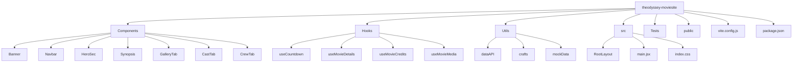
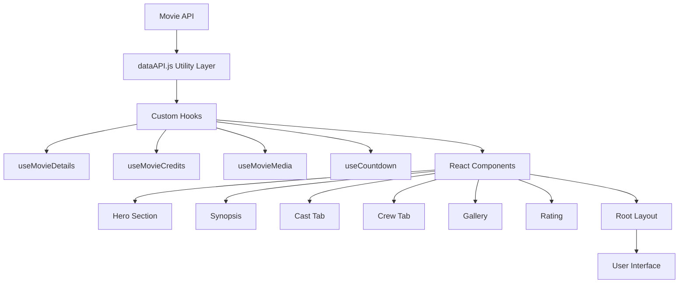
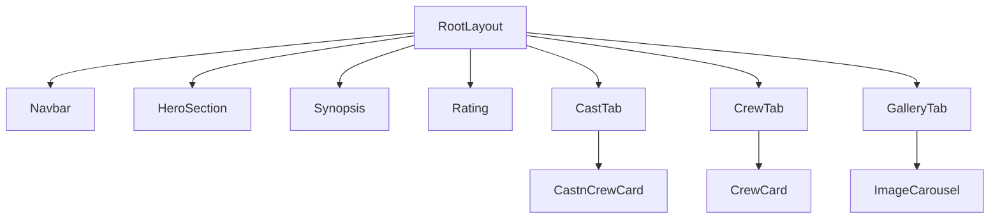
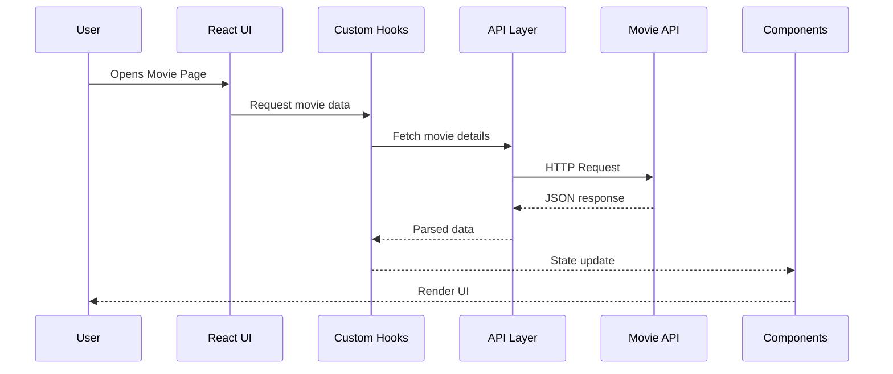

# The Odyssey Movie Website
- A modern cinematic web experience built with React + Vite that presents movie information through immersive UI sections including cast, crew, gallery, synopsis, and countdown features.
The application focuses on modular architecture, reusable components, custom hooks, and smooth UI interactions to deliver an engaging movie showcase.

## Overview
- The Odyssey Movie Site is a frontend application designed to showcase movie information in an interactive and visually rich format.
### 🧩 Structure Explanation

- **Components** – Modular and reusable UI components responsible for rendering sections like hero banners, cast & crew tabs, galleries, ratings, and interactive UI elements.

- **Hooks** – Custom React hooks that encapsulate reusable logic for fetching and managing movie data such as details, credits, media assets, and countdown functionality.

- **Utils** – Utility modules that provide helper functions, API abstraction, and shared data structures across the application.

- **Tests** – Unit tests for critical UI components to ensure reliability and prevent regressions.

- **src** – Core application entry point containing the root layout, global styles, and main React initialization.

- **public** – Static assets such as images, icons, and other resources served directly by the application.

  ## Features
  ### Movie Overview
  - Displays key movie information including synopsis, ratings, and highlights.
  ### Cast & Crew Section
  - Interactive UI displaying cast and crew members with role information.
  ### Media Gallery
  - Carousel-based media gallery showcasing movie visuals.
  ### Countdown Timer
  - Countdown display for movie release events using a custom hook.
  ### Rating Component
  - Reusable component for displaying movie ratings.
  ### Responsive UI
  - Optimized for multiple screen sizes with smooth UI interactions.
  ### Fast Performance
  - Powered by Vite for faster development and optimized builds.
  ### Component Testing
  - Includes test cases for important UI components.
 ## Tech Stack
### Frontend
- React.js
- Vite
- JavaScript (ES6+)
### Styling
- CSS / Tailwind CSS
### Testing
- React Testing Library / Jest
### Development Tools
- ESlint
- Git
- GitHub
## 📂 Project Structure

## 🏗 Application Architecture

## 🧩 Component Architecture

## Data Flow Architecture
## 🔄 Data Flow

## Getting Started
### Prerequisites
Make sure you have installed:
- Node.js (v18+ recommended)
- npm or yarn
### Installation
#### Clone the repository
- git clone https://github.com/sashank-ab4/theodyssey-moviesite.git
#### Navigate the project folder
- cd theodyssey-moviesite
#### Install dependencies
- npm install
#### Usage
- npm run dev
#### Open the app
- http://localhost:5173
#### Testing
- npm test
## Project Roadmap
Future improvements may include:
- Movie search functionality
- Actor profile pages
- Advanced filtering
- Watchlist feature
- Dark / light theme toggle
- Performance optimization
## Project Roadmap
Future improvements may include:
- Movie search functionality
- Actor profile pages
- Advanced filtering
- Watchlist feature
- Dark / light theme toggle
- Performance optimization
## Contributing
- Contributions are welcome:
- Fork the repository
- Create a feature branch
- Commit your changes
- Submit a pull request

## Acknowledgments
Future improvements may include:
- Movie database APIs for movie data
- React Community
- Open source contributions
## Author
### Sashank Akkabattula
- Frontend developer passionate about building modern web experiences.
  https://github.com/sashank-ab4
